# 🌿 Herbify — Visual Project Documentation

> A comprehensive, graphically-rich documentation of the **Herbify** platform — a full-stack MERN e-commerce application for herbal products and medicinal herbs.

---

## 📑 Table of Contents

1. [Project Overview](#1-project-overview)
2. [Tech Stack](#2-tech-stack)
3. [High-Level Architecture](#3-high-level-architecture)
4. [Folder Structure](#4-folder-structure)
5. [Database Schema (Entity Relationship)](#5-database-schema-entity-relationship)
6. [Data Models Detail](#6-data-models-detail)
7. [API Routes Map](#7-api-routes-map)
8. [Frontend Route Tree](#8-frontend-route-tree)
9. [User Flows](#9-user-flows)
   - [9.1 Registration & Login Flow](#91-registration--login-flow)
   - [9.2 Shopping Flow (Browse → Cart → Checkout)](#92-shopping-flow-browse--cart--checkout)
   - [9.3 Order Lifecycle](#93-order-lifecycle)
   - [9.4 Payment Flow (Razorpay)](#94-payment-flow-razorpay)
   - [9.5 Admin Management Flow](#95-admin-management-flow)
10. [Authentication & Security Flow](#10-authentication--security-flow)
11. [Image Upload Pipeline (Cloudinary)](#11-image-upload-pipeline-cloudinary)
12. [Admin Dashboard Components](#12-admin-dashboard-components)
13. [Component Hierarchy](#13-component-hierarchy)
14. [State & Data Flow](#14-state--data-flow)
15. [Deployment Architecture](#15-deployment-architecture)
16. [Feature Matrix](#16-feature-matrix)

---

## 1. Project Overview

Herbify is a full-stack **MERN** (MongoDB, Express, React, Node.js) e-commerce platform specializing in herbal products and medicinal herbs. It features a dual-catalog system (Herbs + Products), a Razorpay payment gateway, Cloudinary image management, OTP-based email verification, and a rich admin dashboard with real-time analytics.

```
┌─────────────────────────────────────────────────────────────────┐
│                         HERBIFY PLATFORM                        │
│                                                                 │
│  🌿 Herbs Catalog    🛍️ Products Store    👤 User Accounts       │
│  📦 Order Tracking   💳 Razorpay Payments  🖼️ Admin Dashboard    │
│  ⭐ Review System    🔍 Search Engine      📧 OTP Verification   │
└─────────────────────────────────────────────────────────────────┘
```

---

## 2. Tech Stack

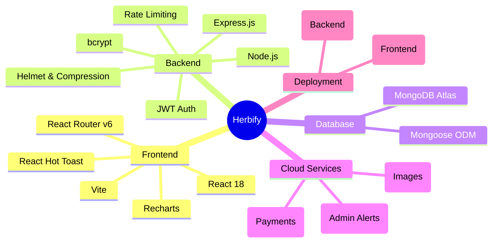

---

## 3. High-Level Architecture

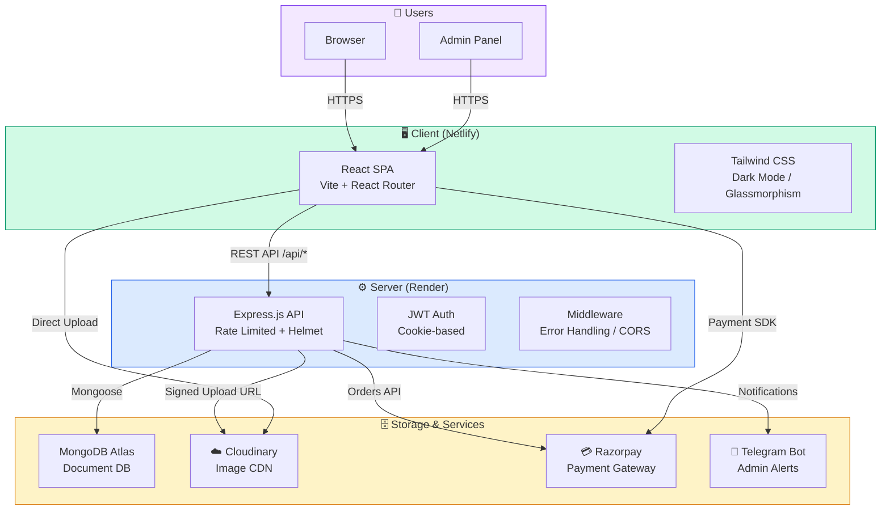

---

## 4. Folder Structure

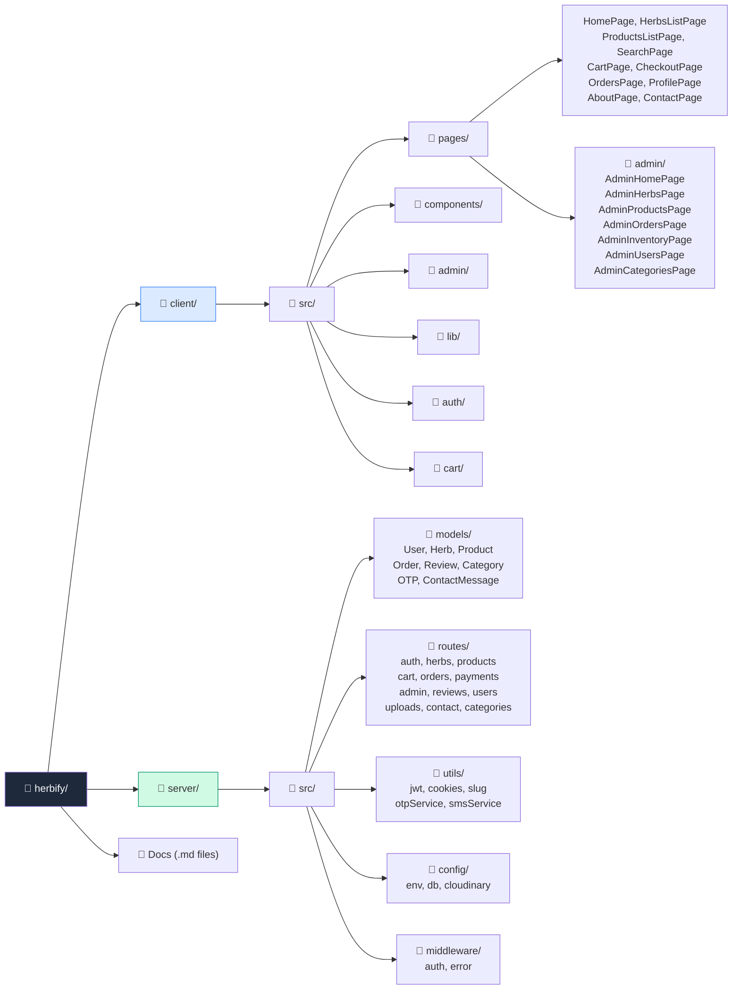

---

## 5. Database Schema (Entity Relationship)

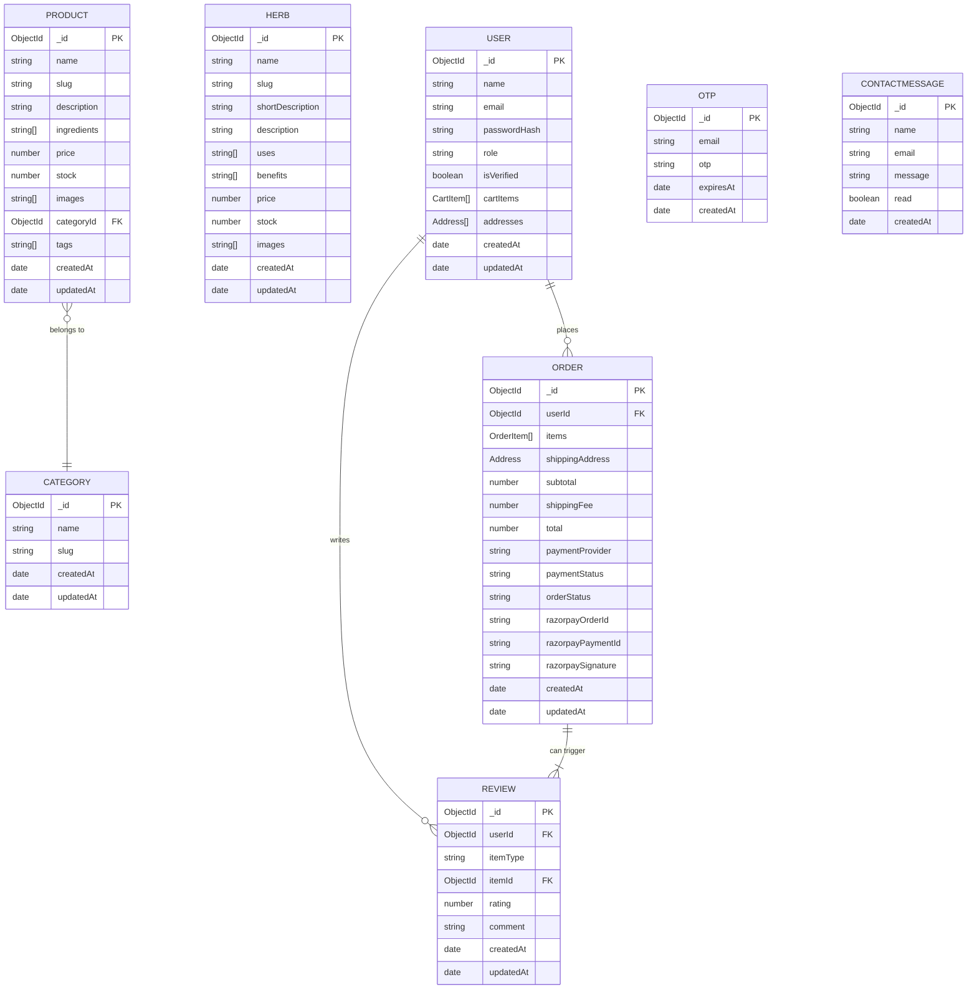

---

## 6. Data Models Detail

### User Schema

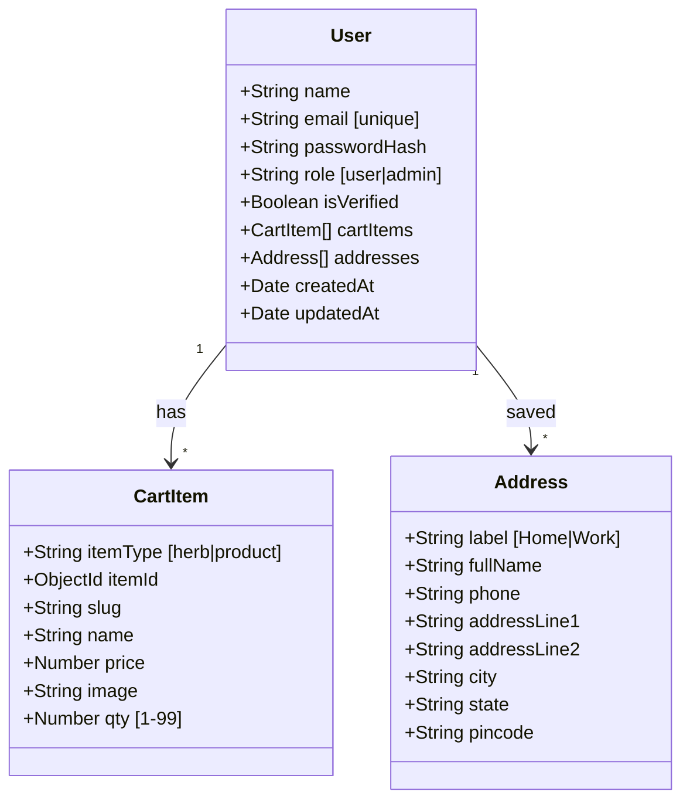

### Order Schema

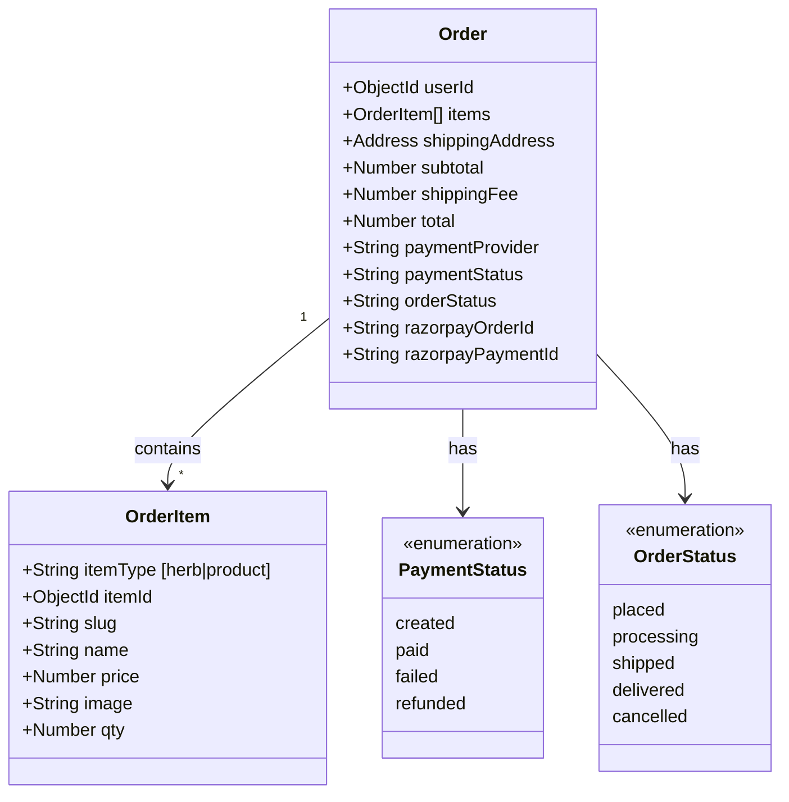

---

## 7. API Routes Map

```mermaid
graph TD
    API["/api/*"]

    API --> Health["/api/health — GET<br/>✅ Health check"]
    API --> AuthRoute["/api/auth"]
    API --> UsersRoute["/api/users"]
    API --> HerbsRoute["/api/herbs"]
    API --> ProductsRoute["/api/products"]
    API --> CategoriesRoute["/api/categories"]
    API --> CartRoute["/api/cart"]
    API --> OrdersRoute["/api/orders"]
    API --> PaymentsRoute["/api/payments"]
    API --> ReviewsRoute["/api/reviews"]
    API --> AdminRoute["/api/admin"]
    API --> UploadsRoute["/api/uploads"]
    API --> ContactRoute["/api/contact"]

    AuthRoute --> A1["POST /register"]
    AuthRoute --> A2["POST /login"]
    AuthRoute --> A3["POST /logout"]
    AuthRoute --> A4["GET /me"]
    AuthRoute --> A5["POST /send-otp"]
    AuthRoute --> A6["POST /verify-otp"]

    HerbsRoute --> H1["GET / — List all herbs"]
    HerbsRoute --> H2["GET /:slug — Herb details"]

    ProductsRoute --> P1["GET / — List products"]
    ProductsRoute --> P2["GET /:slug — Product details"]

    CartRoute --> C1["GET / — Fetch cart"]
    CartRoute --> C2["POST /add — Add item"]
    CartRoute --> C3["POST /remove — Remove item"]
    CartRoute --> C4["DELETE /clear — Clear cart"]

    OrdersRoute --> O1["GET / — User orders"]
    OrdersRoute --> O2["GET /:id — Order detail"]
    OrdersRoute --> O3["POST / — Place order"]

    PaymentsRoute --> Pay1["POST /create-order — Initiate"]
    PaymentsRoute --> Pay2["POST /verify — Verify signature"]

    ReviewsRoute --> R1["GET /:itemType/:itemId"]
    ReviewsRoute --> R2["POST / — Create review"]

    AdminRoute --> Adm1["GET /products, herbs, categories, users, orders"]
    AdminRoute --> Adm2["POST/PUT/DELETE — CRUD operations"]
    AdminRoute --> Adm3["GET /bestsellers — Analytics"]
    AdminRoute --> Adm4["GET /inventory — Stock management"]

    UploadsRoute --> U1["GET /sign — Cloudinary signature"]

    style API fill:#1e293b,color:#f8fafc
    style AdminRoute fill:#7c3aed,color:#fff
    style PaymentsRoute fill:#dc2626,color:#fff
    style AuthRoute fill:#2563eb,color:#fff
```

---

## 8. Frontend Route Tree

```mermaid
graph TD
    Root["/ — App Root"]

    Root --> SiteLayout["SiteLayout (Navbar + Footer)"]

    SiteLayout --> Home["/ — HomePage"]
    SiteLayout --> About["/about — AboutPage"]
    SiteLayout --> Contact["/contact — ContactPage"]
    SiteLayout --> Search["/search — SearchPage"]

    SiteLayout --> Herbs["/herbs — HerbsListPage"]
    Herbs --> HerbDetail["/herbs/:slug — HerbDetailsPage"]

    SiteLayout --> Products["/products — ProductsListPage"]
    Products --> ProductDetail["/products/:slug — ProductDetailsPage"]

    SiteLayout --> Cart["/cart — CartPage"]
    SiteLayout --> Checkout["/checkout — CheckoutPage"]

    SiteLayout --> Login["/login — LoginPage"]
    SiteLayout --> Register["/register — RegisterPage"]

    SiteLayout --> Account["Account (Protected)"]
    Account --> Profile["/account/profile — ProfilePage"]
    Account --> Orders["/account/orders — OrdersPage"]
    Orders --> OrderDetail["/account/orders/:id — OrderDetailsPage"]

    SiteLayout --> AdminGuard["RequireAdmin (role=admin)"]
    AdminGuard --> AdminLayout["AdminLayout"]
    AdminLayout --> AdminHome["/admin — AdminHomePage (Analytics)"]
    AdminLayout --> AdminInventory["/admin/inventory — AdminInventoryPage"]
    AdminLayout --> AdminHerbs["/admin/herbs — AdminHerbsPage"]
    AdminLayout --> AdminProducts["/admin/products — AdminProductsPage"]
    AdminLayout --> AdminCategories["/admin/categories — AdminCategoriesPage"]
    AdminLayout --> AdminOrders["/admin/orders — AdminOrdersPage"]
    AdminLayout --> AdminUsers["/admin/users — AdminUsersPage"]
    AdminLayout --> AdminContacts["/admin/contacts — AdminContactsPage"]

    style AdminGuard fill:#7c3aed,color:#fff
    style AdminLayout fill:#6d28d9,color:#fff
    style Home fill:#059669,color:#fff
```

---

## 9. User Flows

### 9.1 Registration & Login Flow

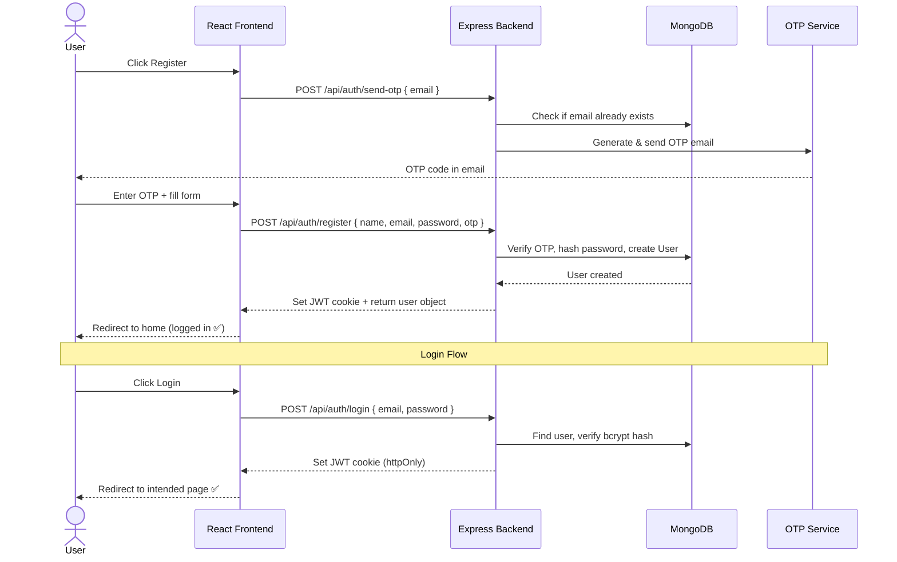

### 9.2 Shopping Flow (Browse → Cart → Checkout)

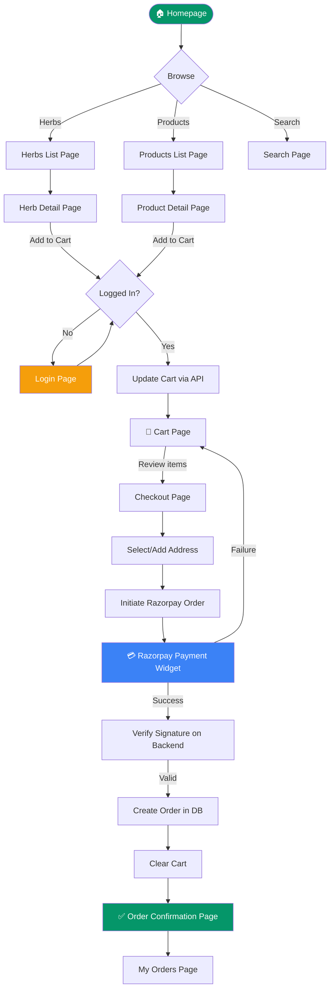

### 9.3 Order Lifecycle

```mermaid
stateDiagram-v2
    [*] --> placed : Payment Verified

    placed --> processing : Admin confirms
    placed --> cancelled : Admin/User cancels

    processing --> shipped : Dispatched
    processing --> cancelled : Out-of-stock / issue

    shipped --> delivered : Delivery confirmed

    delivered --> [*]
    cancelled --> [*]

    note right of placed : 💳 Payment: paid\nAdmin notified via Telegram
    note right of shipped : 📦 Tracking available
    note right of delivered : ⭐ Review can be posted
```

### 9.4 Payment Flow (Razorpay)

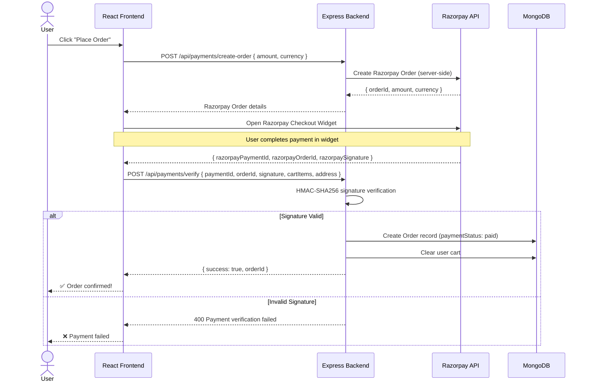

### 9.5 Admin Management Flow

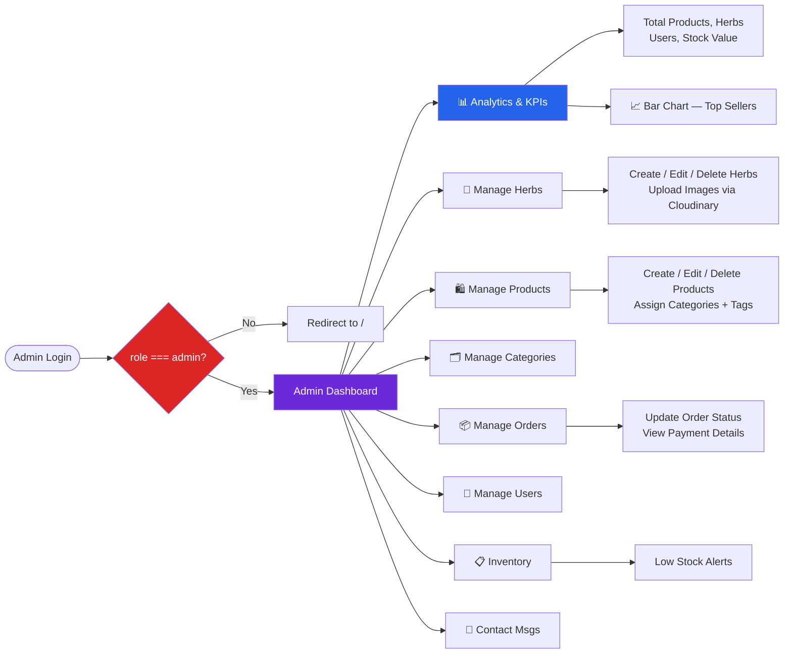

---

## 10. Authentication & Security Flow

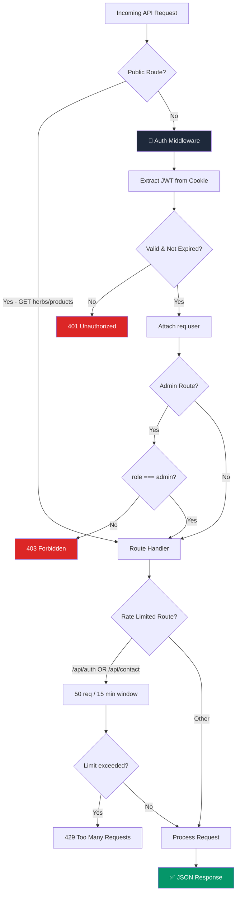

---

## 11. Image Upload Pipeline (Cloudinary)

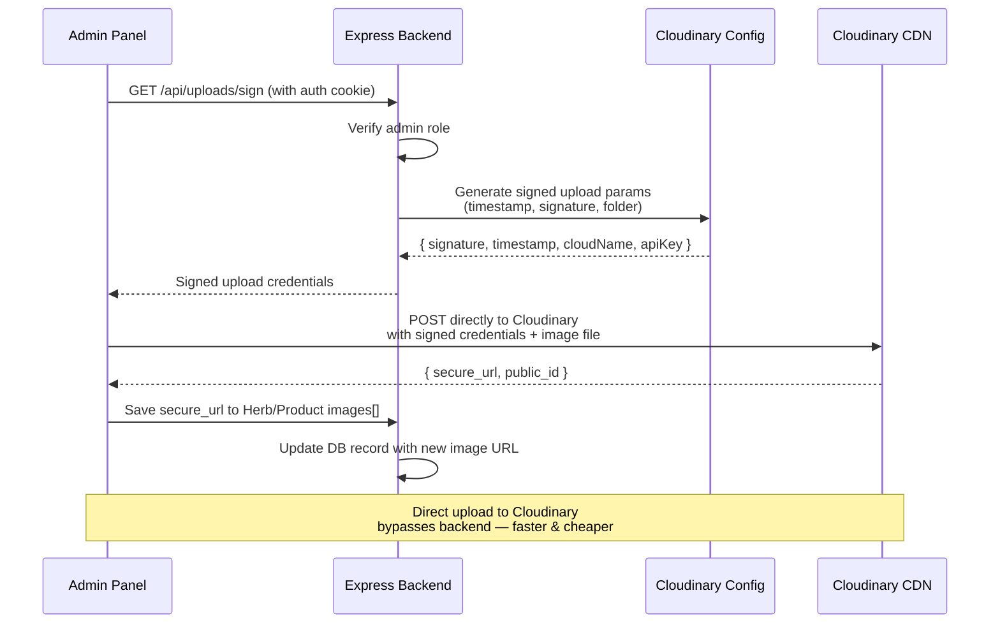

---

## 12. Admin Dashboard Components

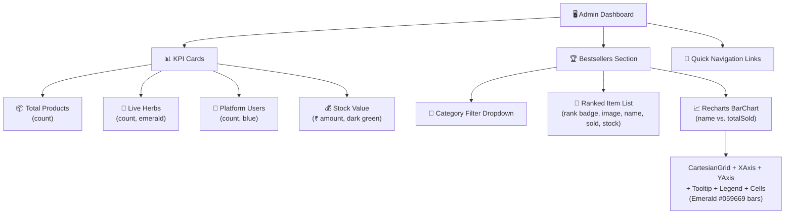

---

## 13. Component Hierarchy

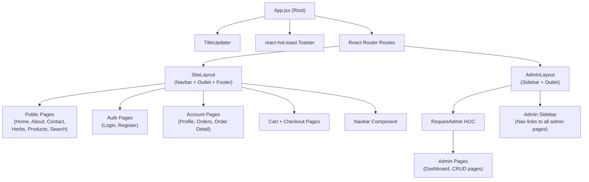

---

## 14. State & Data Flow

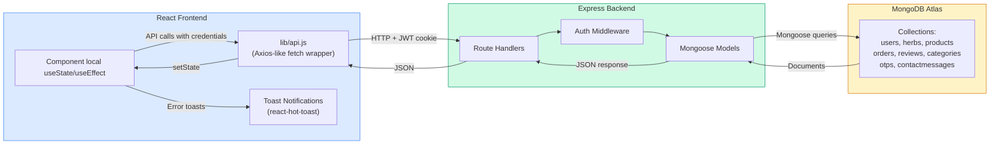

---

## 15. Deployment Architecture

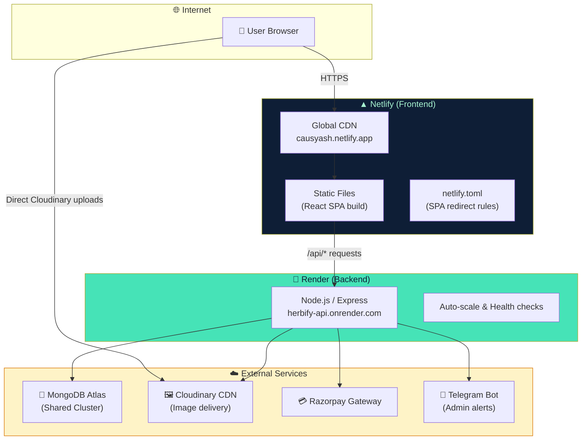

---

## 16. Feature Matrix

| Feature | User | Admin | Notes |
|---|---|---|---|
| 🌿 Browse Herbs | ✅ | ✅ | Filterable, searchable |
| 🛍️ Browse Products | ✅ | ✅ | Category-based |
| 🔍 Search | ✅ | ✅ | Cross-catalog |
| 🛒 Cart Management | ✅ | — | Persisted in MongoDB |
| 💳 Razorpay Checkout | ✅ | — | HMAC signature verified |
| 📦 Order Tracking | ✅ | ✅ | Status pipeline |
| ⭐ Reviews | ✅ | — | Per herb/product |
| 👤 Profile & Addresses | ✅ | — | Multiple saved addresses |
| 📧 OTP Email Verification | ✅ | — | On registration |
| 📊 Analytics Dashboard | — | ✅ | KPIs + Recharts |
| 🏆 Bestsellers Report | — | ✅ | Category-filtered bar chart |
| 📋 Inventory Management | — | ✅ | Stock value, low-stock alerts |
| 🌿 Herb CRUD | — | ✅ | With Cloudinary image upload |
| 🛍️ Product CRUD | — | ✅ | Category + tag assignment |
| 🗂️ Category Management | — | ✅ | Slug-based |
| 👤 User Management | — | ✅ | Role assignment |
| 📦 Order Status Updates | — | ✅ | Full lifecycle control |
| 📧 Contact Inbox | — | ✅ | Read/unread messages |
| 📨 Telegram Notifications | — | ✅ | New order alerts |
| 🖼️ Cloudinary Image CDN | ✅ | ✅ | Signed direct uploads |
| 🔐 JWT Auth (httpOnly) | ✅ | ✅ | Cookie-based |
| 🛡️ Rate Limiting | ✅ | ✅ | Auth + contact routes |
| 🌐 Netlify Deployment | ✅ | ✅ | SPA redirect configured |
| ⚙️ Render Deployment | ✅ | ✅ | Node.js backend |

---

## Order Status Flow (Quick Reference)

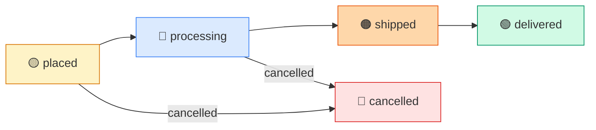

## Payment Status Flow (Quick Reference)

```mermaid
graph LR
    created["🟡 created"] --> paid["🟢 paid"]
    created --> failed["🔴 failed"]
    paid --> refunded["🟣 refunded"]

    style created fill:#fef3c7,stroke:#d97706
    style paid fill:#d1fae5,stroke:#059669
    style failed fill:#fee2e2,stroke:#dc2626
    style refunded fill:#f3e8ff,stroke:#7c3aed
```

---

*Documentation generated: March 2026 | Herbify v1.0 | MERN Stack*
