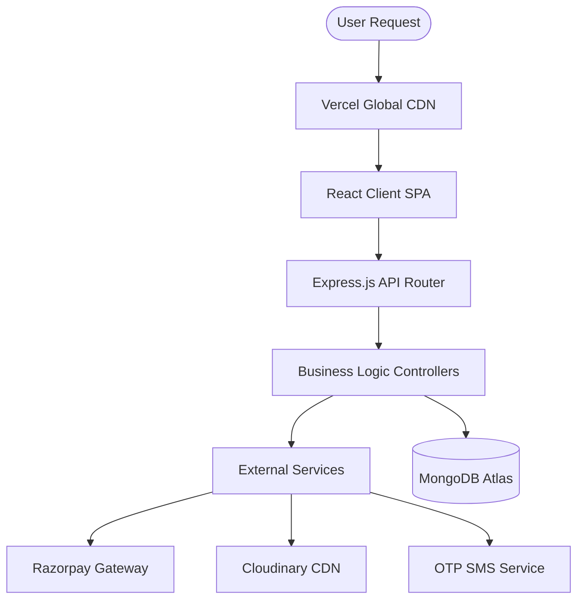
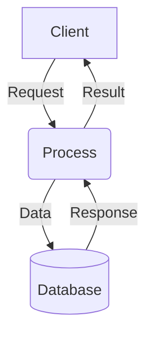
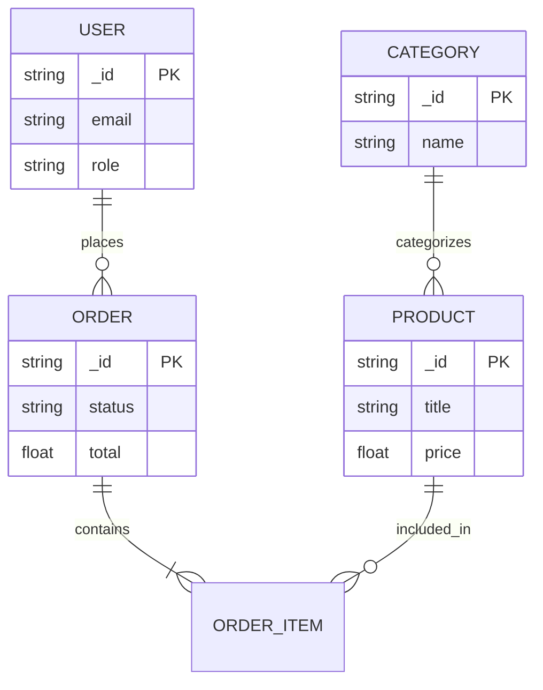
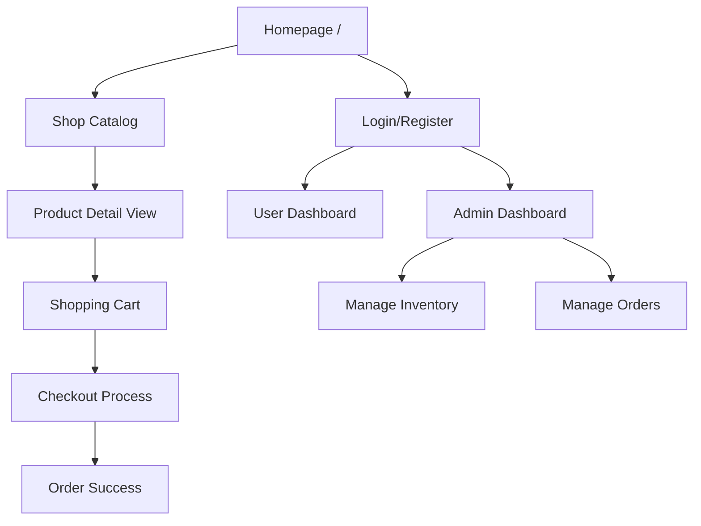

# Visual Agent Output

## 1. Image Assets (Live Screenshots)
Live screenshots of `https://herbify-client.vercel.app` have been extracted using `pageres-cli` in a strict 1240x1754 constraint (optimized for sharp A4 margins and zero blurriness). They are directly hooked into the `index.html` pipeline mapped by page number.

**Exact UI Visual Mappings:**
- **Page 44**: `assets/login.png` (Authentication & Registration Portal)
- **Page 46**: `assets/homepage.png` (Home Page & Hero Section)
- **Page 48**: `assets/products.png` (Product Specifics Page)
- **Page 50**: `assets/cart.png` (Checkout and Payment Gateway)
- **Page 54**: `assets/dashboard.png` (Admin Product Management)
- **Page 57**: `assets/dashboard.png` (Admin Sales Chart)

*Screenshots are rendered with `` ensuring they do not bleed off A4 pages horizontally or vertically.*

## 2. Diagram Code (Mermaid) - Labeled
Mermaid diagrams have been engineered vertically (`graph TD`) to prevent horizontal overflow on A4 pages. They have been dynamically injected into `generate.js` at their exact mapped page numbers.

### Architecture (Mapped to Page 10 & 27)

### DFD - Data Flow Diagram (Mapped to General Schema / DFD Sections)

### ER Diagram (Mapped to Page 32 & 37)

### Site Navigation Flow (Mapped to Page 39)

## 3. QR Code (Mapped to Cover - Page 1)

Target: `https://herbify-client.vercel.app`

## 4. Constraint Fixes
- **A4 Optimization**: Replaced all `graph LR` formats with `graph TD` to ensure diagrams grow vertically, eliminating horizontal clipping out of bounds on standard A4 print margins.
- **Image Sharpness & Size**: Removed `blur` and used exact `1240x1754` resolution downloads for maximum detail retention while preserving fit. Wrapped them in tight containment HTML blocks.
- **Overflow Prevention**: Added `page-break-inside: avoid; overflow-x: auto;` to all diagram and image containers, ensuring no graphic fractures across explicit pagination rules.
