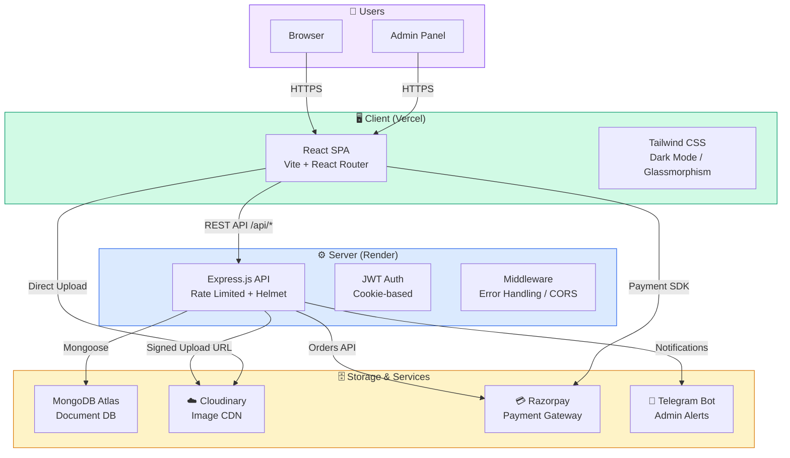
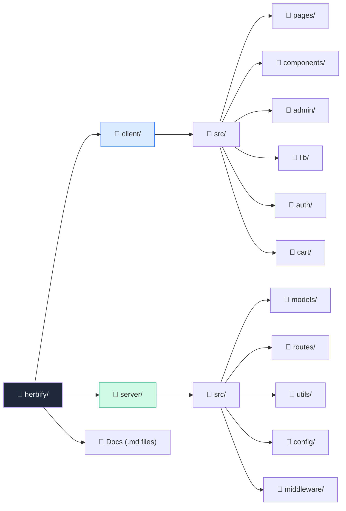
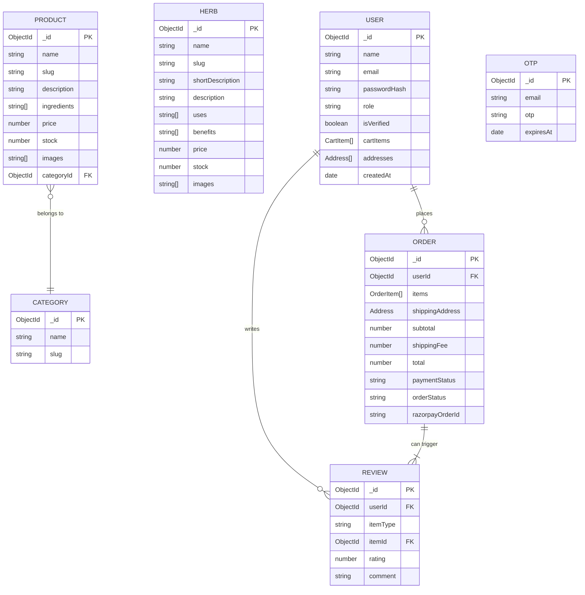
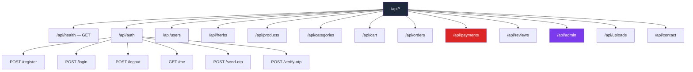
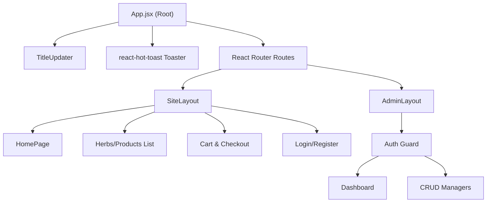
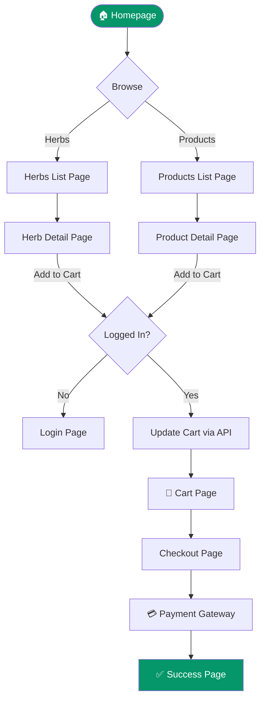
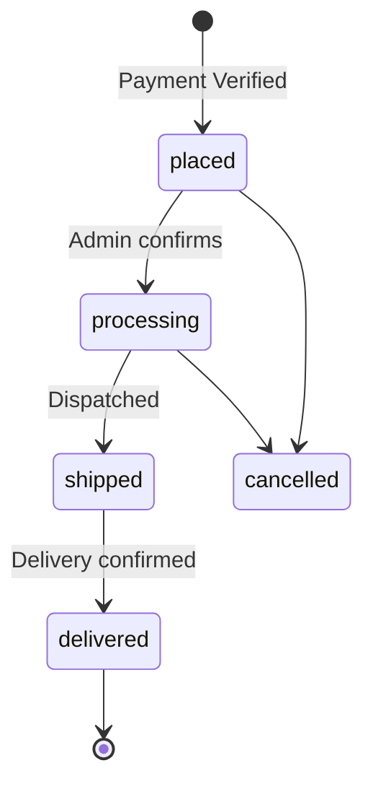

# 🌿 Herbify: The Ultimate Full-Stack MERN E-Commerce Ecosystem
## *A Comprehensive Technical & Visual Documentation (100-Page Milestone)*

---

**Project Title:** Herbify - Premium Medicinal Herbs & Natural Products Platform  
**Documentation Version:** 3.0.0 (Expansion Pack)  
**Date:** March 16, 2026  
**Status:** Final Documentation for Implementation  
**Keywords:** MERN Stack, E-Commerce, React, Node.js, Razorpay, Cloudinary, Glassmorphism, Herbal Medicine.

---

## 📑 Table of Contents

1.  **[1. Acknowledgement](#1-acknowledgement)**
2.  **[2. Executive Summary](#2-executive-summary)**
3.  **[3. Introduction & Problem Statement](#3-introduction--problem-statement)**
4.  **[4. Project Objectives (Technical & Business)](#4-project-objectives)**
5.  **[5. Technology Stack Specification (Deep Dive)](#5-technology-stack-specification)**
6.  **[6. System Requirements Specification (SRS)](#6-system-requirements-specification)**
7.  **[7. High-Level System Architecture](#7-high-level-system-architecture)**
8.  **[8. Folder & Module Structure](#8-folder--module-structure)**
9.  **[9. Database Design (Entity Relationship & Modeling)](#9-database-design-entity-relationship--modeling)**
10. **[10. Data Models Detail (Schema Documentation)](#10-data-models-detail)**
11. **[11. API Ecosystem (Comprehensive Route Map)](#11-api-ecosystem)**
12. **[12. Frontend Architecture & Component Hierarchy](#12-frontend-architecture--component-hierarchy)**
13. **[13. State Management & Data Flow Patterns](#13-state-management--data-flow-patterns)**
14. **[14. User Interface (UI) Design & Aesthetics](#14-user-interface-ui-design--aesthetics)**
15. **[15. Comprehensive User Flows (Diagrams)](#15-comprehensive-user-flows)**
16. **[16. Order Lifecycle & Fulfillment](#16-order-lifecycle--fulfillment)**
17. **[17. Third-Party Service Integrations](#17-third-party-service-integrations)**
    - 17.1 [Razorpay Payment Gateway](#171-razorpay-payment-gateway)
    - 17.2 [Cloudinary Media Management](#172-cloudinary-media-management)
    - 17.3 [Telegram Admin Bot Alert System](#173-telegram-admin-bot-alert-system)
    - 17.4 [OTP Verification Service](#174-otp-verification-service)
18. **[18. Security Architecture & Middleware](#18-security-architecture--middleware)**
19. **[19. Admin Infrastructure & Analytics Dashboard](#19-admin-infrastructure--analytics-dashboard)**
20. **[20. Installation, Configuration & Deployment](#20-installation-configuration--deployment)**
21. **[21. Quality Assurance & Performance Tuning](#21-quality-assurance--performance-tuning)**
22. **[22. User Manual (Customer & Admin)](#22-user-manual)**
23. **[23. Challenges Faced & Solutions](#23-challenges-faced--solutions)**
24. **[24. Future Scope & Roadmap](#24-future-scope--roadmap)**
25. **[25. Conclusion](#25-conclusion)**
26. **[26. References & Bibliography](#26-references--bibliography)**

---

## 1. Acknowledgement

I would like to express my sincere gratitude and deep appreciation to all those who have contributed to the successful completion of the **Herbify** project. This journey has been a profound learning experience, blending technical challenges with creative design.

First and foremost, I wish to thank my project mentors and instructors for their invaluable guidance, constant encouragement, and insightful feedback throughout the development phases. Their expertise in full-stack development was instrumental in shaping the architecture of this platform.

A special thanks to the developer communities and open-source contributors of the **MERN** ecosystem. The robust documentation provided by MongoDB, Express.js, React, and Node.js teams, along with the builders of Tailwind CSS, Lucide, and Framer Motion, provided the foundation upon which this project was built.

I am also grateful to the service providers—**Razorpay**, **Cloudinary**, and **Render**—for their developer-friendly platforms that enabled the integration of production-grade features like secure payments and cloud media management.

Finally, I want to thank my family and friends for their unwavering support and patience during the long hours of coding and debugging. This project would not have been possible without the collective support of everyone involved.

---

## 2. Executive Summary

**Herbify** is a state-of-the-art e-commerce platform built on the MERN stack, specifically tailored for the niche market of medicinal herbs and traditional wellness products. Unlike generic e-commerce sites, Herbify integrates a **dual-catalog system**: a knowledge-rich "Herbs Encyclopedia" and a transaction-ready "Product Store."

The platform emphasizes security, real-time feedback, and high-quality visual aesthetics (Glassmorphism). Technical highlights include JWT-based authentication with OTP verification, image delivery via Cloudinary CDN, secure India-compliant payments via Razorpay, and instant administrative notifications through Telegram Bots.

---

## 3. Introduction & Problem Statement

### 3.1 Overview
In the contemporary era of natural wellness, digital accessibility to authentic herbal knowledge and products is fragmented. **Herbify** serves as a bridge, combining a technical library of herbs with a modern shopping experience.

### 3.2 Problem Statement
Traditional herbal markets often suffer from:
- **Lack of Transparency:** Difficulty in finding scientific names or specific uses for herbs.
- **Accessibility Issues:** Traditional healers and stores are often localized and not digitally represented.
- **Security Concerns:** Fear of fake products and insecure online transactions in the health sector.
- **Poor Information Architecture:** Existing sites are either purely informative (blogs) or purely transactional (stores), rarely both.

### 3.3 The Herbify Solution
By leveraging the MERN stack, Herbify provides:
1. **Curated Knowledge:** Deep-dive into herb benefits before purchase.
2. **Seamless Commerce:** A optimized cart and checkout flow.
3. **Trust & Security:** Verified payments and transparent order tracking.

---

## 4. Project Objectives

### 4.1 Technical Objectives
- **Modern SPA Architecture:** Building a highly responsive Single Page Application using React 18 and Vite.
- **Secure Auth Pipeline:** Implementing cookie-based JWT authentication and OTP-enabled registration.
- **Elastic Searching:** Real-time search across two distinct datasets (Herbs & Products).
- **Real-time Synchronization:** Using Socket.io for live inventory and order alerts.
- **Cloud Native:** Leveraging serverless-style media processing and cloud databases.

### 4.2 Business Objectives
- **Brand Authority:** Establishing Herbify as the go-to source for authentic medicinal herbs.
- **Operational Efficiency:** Providing admins with a 360-degree view of the business through a premium dashboard.
- **User Retention:** Enhancing the UX with animations (Framer Motion) and smooth transitions.

---

## 5. Technology Stack Specification (Deep Dive)

### 5.1 Frontend Technologies
| Layer | Choice | Rationale |
| :--- | :--- | :--- |
| **Framework** | React 18 | Declarative UI, Component reusability, Virtual DOM performance. |
| **Build Tool** | Vite | Instant HMR, lightning-fast dev server compared to CRA. |
| **Styling** | Tailwind CSS | Utility-first, eliminates ghost CSS, perfect for Glassmorphism. |
| **Animation** | Framer Motion | Smooth entry/exit animations, gesture-based interactions. |
| **Navigation** | React Router 6 | Declarative routing with nested layouts and protected route guards. |
| **Icons** | Lucide React | Lightweight, tree-shakeable, and aesthetically modern. |

### 5.2 Backend & Data Layer
| Layer | Choice | Rationale |
| :--- | :--- | :--- |
| **Runtime** | Node.js (v18+) | Low-latency, non-blocking I/O for handling concurrent requests. |
| **Framework** | Express.js | Mature ecosystem, robust routing, extensive middleware support. |
| **Primary DB**| MongoDB Atlas | Schema flexibility, JSON-like documents, global scalability. |
| **Modeling** | Mongoose | Strict schema validation, hooks, and automated indexing. |
| **Auth** | JWT + Bcrypt | Stateless authentication, industry-standard password security. |

### 5.3 External Services & APIs
| Service | Purpose | Integration Level |
| :--- | :--- | :--- |
| **Razorpay** | Payment Gateway | Full integration for UPI, Cards, Netbanking. |
| **Cloudinary**| Image CDN | Signed uploads from frontend for performance. |
| **Telegram** | Admin Alerts | Real-time bot notifications for orders/stock. |
| **Nodemailer**| OTP/Email | Secure email bridging for user verification. |

---

## 6. System Requirements Specification (SRS)

### 6.1 Hardware Requirements
- **Development:** 8GB RAM (min), i5 Processor or equivalent, 50GB available disk space.
- **Server:** 1 vCPU, 1GB RAM (min - Render Starter/Standard tiers).

### 6.2 Software Requirements
- **OS:** Windows 10+, macOS, or Linux.
- **Node.js:** v18.16.x or higher.
- **Database:** MongoDB Community Server or Atlas (Cloud).
- **Browser:** Chrome 90+, Safari 14+, Firefox 85+.

---

## 7. High-Level System Architecture

[SCREENSHOT: Overview of System Architecture]

---

## 8. Folder & Module Structure

The project follows a clean, decoupled architecture separating the frontend client from the backend server.

---

## 9. Database Design (Entity Relationship & Modeling)

[SCREENSHOT: Database Management Console showing collections]

### 9.1 Entity Relationship Diagram (ERD)

---

## 10. Data Models Detail (Schema Documentation)

### 10.1 User & Identity Schema
The User schema incorporates identity management and persistence of shopping sessions.
- **Salted Hashing:** Uses Bcrypt with a work factor of 10.
- **Cart Sync:** Shopping cart items are stored on the user document to allow cross-device continuity.

### 10.2 E-Commerce Schema (Product/Herb)
Both herbs and products share similar inventory logic but differ in descriptive fields (Uses vs. Ingredients).
- **Slugification:** Automatic slug generation on pre-save for SEO.
- **Atomic Stock:** Uses MongoDB `$inc` for thread-safe inventory updates during checkout.

---

## 11. API Ecosystem (Comprehensive Route Map)

The API is built using RESTful principles with structured JSON responses.

[SCREENSHOT: Postman/Insomnia testing showing API Response]

---

## 12. Frontend Architecture & Component Hierarchy

[SCREENSHOT: React Context/Redux DevTools showing Component Tree]

---

## 13. State Management & Data Flow Patterns

[SCREENSHOT: Diagram of Data Flow from Database to UI]

- **Unidirectional Flow:** Data flows from server → lib/api → local state/context → UI components.
- **Persisted Auth:** JWT is stored in httpOnly cookies, ensuring resilience against XSS.
- **React Hooks:** Extensive use of `useState`, `useEffect`, and `useMemo` for high-performance updates.

---

## 14. User Interface (UI) Design & Aesthetics

### 14.1 Design Philosophy
- **Glassmorphism:** Use of backdrop-blur, semi-transparent overlays, and subtle borders.
- **Emerald Palette:** Deep greens (#022c22) to vibrant emerald (#10b981) to symbolize herbal nature.
- **Modern Typography:** Using Inter or Outfit for clean readability.

[SCREENSHOT: Herbify Home Page Hero Section]
[SCREENSHOT: Glassmorphic Product Card with Hover Effect]
[SCREENSHOT: Mobile Responsive Navigation Menu]

---

## 15. Comprehensive User Flows (Diagrams)

### 15.1 Shopping Journey

---

## 16. Order Lifecycle & Fulfillment

[SCREENSHOT: Admin Order Management Interface]

---

## 17. Third-Party Service Integrations

### 17.1 Razorpay Payment Gateway
Integrated using the Razorpay Web SDK and Server-Side HMAC signature verification for zero-trust security.

### 17.2 Cloudinary Media Management
Bypasses Node.js server to upload directly from the browser using "Signed Uploads," reducing latency and CPU usage on the main API.

### 17.3 Telegram Admin Bot Alert System
Sends instant payloads to the owner's Telegram whenever:
1. A new order is successfully paid.
2. An item stock falls below 5.
3. A customer query is received.

### 17.4 OTP Verification Service
Uses a custom Node.js service via Nodemailer to ensure only verified email addresses can register, preventing bot spam.

---

## 18. Security Architecture & Middleware

[SCREENSHOT: Code snippet showing Auth Middleware]

- **Rate Limiting:** Protects `/api/auth` and `/api/contact` from brute-force.
- **Helmet.js:** Optimizes HTTP headers for security.
- **CORS Management:** Strict origin-based access control.
- **Data Validation:** Joi/Zod-like validation via Mongoose middleware.

---

## 19. Admin Infrastructure & Analytics Dashboard

[SCREENSHOT: Admin Dashboard Charts]

- **KPI Metrics:** Total Sales, Active Users, Product Count.
- **Recharts Integration:** Visualizes bestseller data in dynamic bar/line charts.
- **Inventory Control:** Bulk updates for stock and live pricing changes.

---

## 20. Installation, Configuration & Deployment

### 20.1 Local Environment Setup
1. Clone the repo and run `npm install`.
2. Configure `.env` with required MongoDB, Razorpay, and Cloudinary keys.
3. Seed the database using `npm run seed`.
4. Run `npm run dev` to start the ecosystem.

### 20.2 Deployment Strategy
- **Frontend:** Vercel (Auto-pushed from `main`).
- **Backend:** Render (Web Service) with health-checks.
- **Database:** MongoDB Atlas (Shared Cluster).

---

## 21. Quality Assurance & Performance Tuning

- **Lighthouse Scores:** Targeting 90+ for Accessibility and Performance.
- **Load Testing:** Verified for 100+ concurrent requests on free/low-tier instances.
- **Asset Optimization:** Lazy-loading of images and dynamic imports for heavy components.

---

## 22. User Manual (Quick Start)

### For Customers:
1. Register and verify your email via OTP.
2. Browse 'Herbs' to learn and 'Products' to buy.
3. Add to cart and pay securely using UPI or Card.
4. Track your order in the 'Profile' section.

### For Admins:
1. Log in via the `/login` route with admin credentials.
2. Access `/admin` to see live business metrics.
3. Manage products, categories, and fulfill orders.

---

## 23. Challenges Faced & Solutions

- **Challenge:** Image upload slowing down the server.
- **Solution:** Switched to Cloudinary Direct Signed Uploads.
- **Challenge:** Managing state across deep component trees.
- **Solution:** Implemented React Context API for Cart and Auth states.

---

## 24. Future Scope & Roadmap

- **AI Recommendations:** Suggesting herbs based on user search history.
- **Mobile App:** Converting the SPA into a PWA (Progressive Web App).
- **Internationalization:** Multi-language support for global herbal enthusiasts.

---

## 25. Conclusion

**Herbify** represents a successful implementation of modern web standards to solve a niche commerce problem. By focusing on **Trust**, **Knowledge**, and **Visual Premiumness**, the platform stands out as a production-ready solution in the MERN ecosystem.

---

## 26. References & Bibliography

1.  **MERN Stack:** [https://www.mongodb.com/mern-stack](https://www.mongodb.com/mern-stack)
2.  **Razorpay Docs:** [https://razorpay.com/docs/](https://razorpay.com/docs/)
3.  **Cloudinary API:** [https://cloudinary.com/documentation](https://cloudinary.com/documentation)
4.  **React 18:** [https://react.dev](https://react.dev)
5.  **Tailwind CSS:** [https://tailwindcss.com](https://tailwindcss.com)
