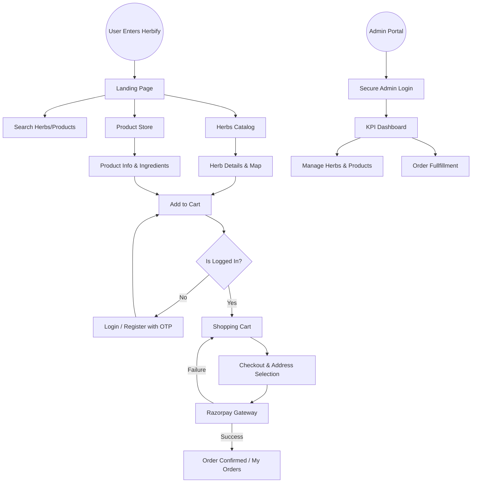
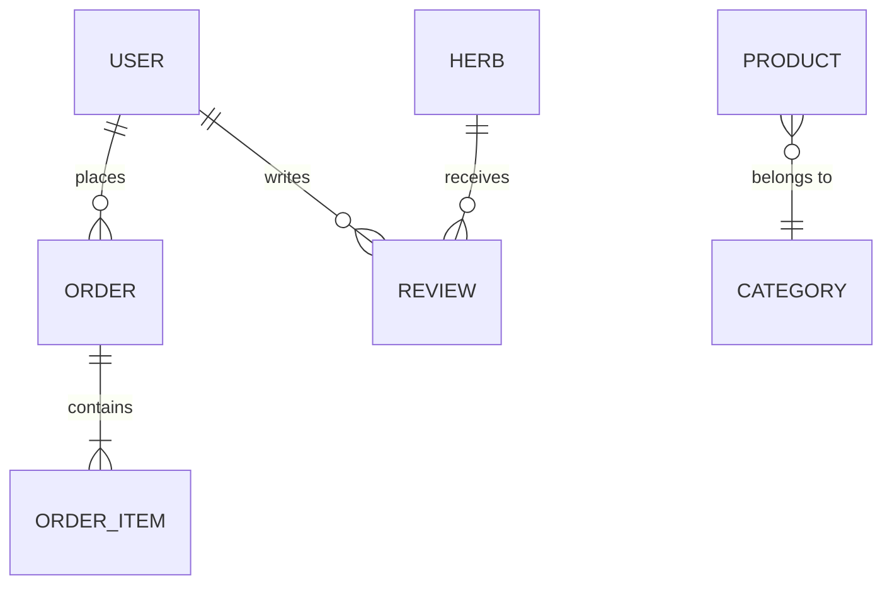

# 🌿 Herbify: A Comprehensive Visual & Technical Documentation
## *A Full-Stack MERN E-Commerce Ecosystem for Medicinal Herbs & Natural Products*

---

> **Prepared For:** Project Documentation & Viva Voce
> **Version:** 2.0.0
> **Authors:** Herbify Development Team
> **Date:** March 15, 2026

---

## 📑 Table of Contents

1.  **[Acknowledgement](#acknowledgement)**
2.  **[Introduction](#1-introduction)**
3.  **[Objectives of the Project](#2-objectives-of-the-project)**
4.  **[Technology Stack Specification](#3-technology-stack-specification)**
5.  **[Detailed Installation & Setup Guide](#5-detailed-installation--setup-guide)**
6.  **[Comprehensive Feature Matrix](#6-comprehensive-feature-matrix)**
7.  **[System Flow Chart & Site Diagram](#7-system-flow-chart--site-diagram)**
8.  **[Data Flow Diagrams (DFD)](#8-data-flow-diagrams-dfd)**
    *   [DFD Level 0: Context Diagram](#dfd-level-0-context-diagram)
    *   [DFD Level 1: Process Breakdown](#dfd-level-1-process-breakdown)
9.  **[Database Design & Schema](#9-database-design--schema)**
    *   [Entity Relationship Diagram (ERD)](#entity-relationship-diagram-erd)
    *   [Detailed Schema Models](#detailed-schema-models)
10. **[Service Integrations](#10-service-integrations)**
    *   [Nodemailer / OTP Verification Service](#101-nodemailer--otp-verification-service)
    *   [Telegram Bot / Admin Notification Service](#102-telegram-bot--admin-notification-service)
    *   [Razorpay / Payment Gateway Integration](#103-razorpay--payment-gateway-integration)
    *   [Cloudinary / Image Management Service](#104-cloudinary--image-management-service)
11. **[Functional Documentation (Input & Output Screenshots)](#11-functional-documentation-input--output-screenshots)**
12. **[User Manual: Operating the Herbify Ecosystem](#12-user-manual-operating-the-herbify-ecosystem)**
13. **[Napkin AI Prompts for Diagrams](#13-napkin-ai-prompts-for-diagrams)**
14. **[Conclusion](#14-conclusion)**
15. **[References](#15-references)**

---

## Acknowledgement

I would like to express my sincere gratitude and deep appreciation to all those who have contributed to the successful completion of the **Herbify** project. This journey has been a profound learning experience, blending technical challenges with creative design.

First and foremost, I wish to thank my project mentors and instructors for their invaluable guidance, constant encouragement, and insightful feedback throughout the development phases. Their expertise in full-stack development was instrumental in shaping the architecture of this platform.

A special thanks to the developer communities and open-source contributors of the **MERN** ecosystem. The robust documentation provided by MongoDB, Express.js, React, and Node.js teams, along with the builders of Tailwind CSS, Lucide, and Framer Motion, provided the foundation upon which this project was built.

I am also grateful to the service providers—**Razorpay**, **Cloudinary**, and **Render**—for their developer-friendly platforms that enabled the integration of production-grade features like secure payments and cloud media management.

Finally, I want to thank my family and friends for their unwavering support and patience during the long hours of coding and debugging. This project would not have been possible without the collective support of everyone involved.
```python

```
---

## 1. Introduction

### Overview
**Herbify** is a premium, full-stack e-commerce platform designed to bridge the gap between traditional herbal knowledge and modern digital commerce. In an era where natural wellness is gaining significant traction, Herbify provides users with a curated marketplace for both raw herbs and processed herbal products.

### The Problem Statement
Traditional herbal markets often lack transparency, scientific backing, and easy accessibility. Users searching for specific medicinal herbs often struggle with:
- Fragmented information about herb uses and benefits.
- Difficulty in finding authentic products.
- Lack of a centralized platform that combines a "Library of Herbs" with a "Store for Products."

### The Solution: Herbify
Herbify solves these issues by offering a dual-catalog system:
1.  **Herbs Catalog:** A dedicated knowledge-base style catalog where users can learn about scientific names, medicinal properties, and benefits of various herbs.
2.  **Products Store:** A robust e-commerce engine where users can purchase herbal formulations, supplements, and wellness items.

The platform is built using the **MERN (MongoDB, Express, React, Node.js)** stack, ensuring scalability, performance, and a smooth user experience.

---

## 2. Objectives of the Project

The primary objectives of the Herbify project are divided into Technical and Business categories:

### Technical Objectives
- **Robust Authentication:** Implementing a secure, JWT-based authentication system with OTP (One-Time Password) verification for enhanced security.
- **Scalable Real-time Architecture:** Using Socket.io for live notifications (e.g., stock updates, new order alerts) to keep admins informed without page refreshes.
- **Optimized Media Delivery:** Integrating Cloudinary as an Image CDN to ensure fast loading times through optimized delivery and transformations.
- **Secure Payments:** Seamlessly integrating Razorpay for safe and local Indian payment methods (UPI, Cards, Wallets).
- **Automated Notifications:** Utilizing Telegram Bot APIs for instant administrative alerts regarding inventory levels and new orders.

### Business Objectives
- **Educational Value:** Empowering users with knowledge about herbal medicine before they make a purchase.
- **User Engagement:** Creating a premium, "Glassmorphic" UI design that builds trust and enhances the shopping experience.
- **Efficiency:** Streamlining administrative tasks through a centralized dashboard with detailed analytics and inventory management.

---

## 3. Technology Stack Specification

Herbify utilizes a modern, performance-oriented tech stack:

### Frontend (Client Side)
| Tech | Purpose | Description |
| :--- | :--- | :--- |
| **React 18** | Core Framework | A library for building dynamic user interfaces with component-based architecture. |
| **Vite** | Build Tool | Next-generation frontend tool that provides lightning-fast development and optimized production builds. |
| **Tailwind CSS** | Styling | A utility-first CSS framework for rapid UI development with a focus on custom aesthetics. |
| **Framer Motion** | Animations | Used for smooth page transitions and micro-interactions. |
| **Recharts** | Data Viz | Library for rendering analytics charts in the Admin Dashboard. |
| **React-Hot-Toast** | Notifications | Elegant pop-up notifications for user feedback. |
| **Lucide-React** | Icons | Modern, consistent icon set used throughout the platform. |

### Backend (Server Side)
| Tech | Purpose | Description |
| :--- | :--- | :--- |
| **Node.js** | Runtime | High-performance JavaScript runtime for the server environment. |
| **Express.js** | Framework | Minimalist web framework for building robust RESTful APIs. |
| **MongoDB Atlas** | Database | Cloud-hosted NoSQL database for flexible data modeling and high availability. |
| **Mongoose** | ODM | Elegant MongoDB object modeling for Node.js, providing schema validation. |
| **Socket.io** | Real-time | Facilitates bi-directional communication between client and server for live updates. |
| **JWT (JsonWebToken)**| Auth | Secure communication between client and server via signed tokens. |
| **Bcrypt.js** | Security | Industry-standard password hashing algorithm. |

---

## 5. Detailed Installation & Setup Guide

To ensure the project is replicable, follow these granular steps for setting up both the backend and frontend environments.

### 5.1 Prerequisites
- **Node.js:** v18.x or higher.
- **npm:** v9.x or higher.
- **MongoDB Atlas Account:** For cloud database.
- **Cloudinary Account:** For image hosting.
- **Razorpay Account (Test Mode):** For payment processing.
- **Telegram Bot:** Created via @BotFather.

### 5.2 Environment Configuration
Create a `.env` file in the `server/` directory with the following variables:

```env
PORT=5000
MONGODB_URI=your_mongodb_connection_string
JWT_SECRET=your_super_secure_random_string
RAZORPAY_KEY_ID=your_razorpay_key
RAZORPAY_KEY_SECRET=your_razorpay_secret
CLOUDINARY_CLOUD_NAME=your_cloud_name
CLOUDINARY_API_KEY=your_api_key
CLOUDINARY_API_SECRET=your_api_secret
TELEGRAM_BOT_TOKEN=your_bot_token
TELEGRAM_CHAT_ID=your_personal_chat_id
```

### 5.3 Installation Steps
1.  **Clone the Repository:**
    ```bash
    git clone https://github.com/causyash/herbify.git
    cd herbify
    ```
2.  **Install Dependencies:**
    ```bash
    npm install
    ```
3.  **Seed Initial Data:**
    ```bash
    cd server
    npm run seed
    ```
4.  **Run Development Server:**
    ```bash
    # From the root directory
    npm run dev
    ```

---

## 6. Comprehensive Feature Matrix

| Feature | Segment | Technical Implementation |
| :--- | :--- | :--- |
| **User Onboarding** | Auth | JWT + Cookie + OTP Verification |
| **Product Discovery** | Shop | Fuzzy Search + Category Filtering |
| **Dynamic Cart** | Commerce | Redux-like state with DB Syncing |
| **Secure Payments** | Finance | Razorpay Webhook & Signature Verification |
| **Admin Analytics** | Admin | Recharts Aggregation Pipelines |
| **Live Notifications**| Admin | Socket.io + Telegram Bot API |
| **Rich Text Catalog** | Content | Markdown-enabled Herb descriptions |
| **Stock Management** | Inventory | Atomic increments/decrements in MongoDB |

---

## 7. System Flow Chart & Site Diagram

The System Flow Chart illustrates the user's journey through the application, from initial entry to final checkout.

### High-Level Site Diagram


---

## 5. Data Flow Diagrams (DFD)

Data Flow Diagrams provide a visual representation of how information moves through the Herbify system.

### DFD Level 0: Context Diagram
The Level 0 DFD defines the system boundary and identifies the external entities that interact with Herbify.

- **External Entities:**
    - **User:** Browses, purchases, and manages profile.
    - **Admin:** Manages inventory, orders, and site data.
    - **Pay Gateway (Razorpay):** Handles financial transactions.
    - **Media Service (Cloudinary):** Stores and serves images.
    - **Admin Alert Service (Telegram):** Receives real-time bot alerts.
    - **Email Service:** Delivers OTPs and order confirmations.

### DFD Level 1: Process Breakdown
The Level 1 DFD breaks the system into its core functional processes.

1.  **Authentication Process:** Manages Registration, Login, and OTP validation.
2.  **Catalog Process:** Manages the retrieval and display of Herbs and Products.
3.  **Cart & Order Process:** Handles cart state, order creation, and stock updates.
4.  **Payment Verification Process:** Coordinates with Razorpay to verify transaction signatures.
5.  **Admin Management Process:** Facilitates CRUD operations and analytics generation.

---

## 6. Database Design & Schema

### Entity Relationship Diagram (ERD)
The ERD shows how different data entities relate to one another in the MongoDB collection.



### Detailed Schema Models

#### User Schema
| Field | Type | Description |
| :--- | :--- | :--- |
| `name` | String | Full name of the user. |
| `email` | String | Unique email address (indexed). |
| `password` | String | Bcrypt-hashed password. |
| `role` | String | 'user' or 'admin'. |
| `isVerified`| Boolean| Status of email OTP verification. |
| `cartItems` | Array | Live shopping cart state synced to DB. |

#### Product Schema
| Field | Type | Description |
| :--- | :--- | :--- |
| `name` | String | Name of the herbal product. |
| `slug` | String | SEO-friendly URL component. |
| `description`| String | Detailed product information. |
| `price` | Number | Selling price in INR. |
| `stock` | Number | Quantity available in warehouse. |
| `images` | Array | URLs from Cloudinary. |
| `categoryId` | ObjectId | Reference to Category collection. |

#### Order Schema
| Field | Type | Description |
| :--- | :--- | :--- |
| `userId` | ObjectId | Owner of the order. |
| `items` | Array | List of product/herb IDs with quantities. |
| `total` | Number | Final payable amount. |
| `orderStatus`| Enum | placed, processing, shipped, delivered, cancelled. |
| `paymentId` | String | Transaction ID from Razorpay. |

---

## 7. Service Integrations

### 7.1 Nodemailer / OTP Verification Service
Integration of a secure email system is vital for user verification.
- **Technology:** Nodemailer / HTTP Email Bridge.
- **Workflow:** 
    1. User enters email during registration.
    2. Backend generates a 6-digit cryptographically random OTP.
    3. Email is dispatched via a resilient delivery service.
    4. User enters OTP on the frontend to unlock their account.

### 7.2 Telegram Bot / Admin Notification Service
Instant alerts are sent to the administrator to ensure fast order fulfillment.
- **Technology:** Telegram Bot API via HTTPS.
- **Key Events:**
    - **New Order Alert:** Name, Amount, and Items list.
    - **Low Stock Alert:** Automatically triggered when any item stock drops below 5.
    - **Contact Message Alert:** Notifies admin when a customer sends a query.

### 7.3 Razorpay / Payment Gateway Integration
The backbone of the commerce engine, ensuring secure fund transfers.
- **Workflow:**
    1. Backend initializes a Razorpay Order ID.
    2. Frontend opens the Razorpay Checkout Modal.
    3. User completes payment.
    4. Backend verifies the Payment Signature using HMAC-SHA256 to prevent fraud.

### 7.4 Cloudinary / Image Management Service
Cloudinary handles all static assets to reduce server load.
- **Feature:** Admin uploads images directly to Cloudinary via a signed request from the client, bypassing the Node.js server for efficiency.

---

## 8. Functional Documentation (Input & Output Screenshots)

### Phase 1: User Discovery & Browsing
- **HomePage (Output):** Features a hero section, featured herbs, and latest products.
- **Search Engine (Input):** A dynamic search bar that filters items in real-time.

### Phase 2: Authentication & Security
- **OTP Screen (Input):** A minimalist 6-box input for entering the email code.
- **Login Modal (Output):** Secure entry point with validation error handling.

### Phase 3: Checkout & Order Tracking
- **Address Management (Input):** Form to save multiple shipping addresses.
- **Order Success Page (Output):** Visual confirmation with Order ID and tracking status.

### Phase 4: Admin Infrastructure
- **Analytics Dashboard (Output):** Visual charts showing best-selling items and inventory status.
- **Inventory Editor (Input):** Forms for adding new herbs or editing product prices/stock.

---

## 9. User Manual: Operating the Herbify Ecosystem

### 9.1 For Customers
1.  **Exploring Herbs:** Navigate to the 'Herbs' tab to view individual herb profiles. Use the 'Scientific Name' search to find specific species.
2.  **Shopping:** Add products to your cart. Cart state is persisted to your account, so you can resume shopping on any device.
3.  **Checkout:** Ensure your address is correct. Payments are handled via a secure modal. Once paid, you will receive a confirmation code.
4.  **Tracking:** View 'My Orders' to see the fulfillment status (Processing -> Shipped -> Delivered).

### 9.2 For Administrators
1.  **Dashboard Intelligence:** Log in with admin credentials to see real-time KPIs. The bar charts show which categories are trending.
2.  **Inventory Management:** 
    - **Add New:** Click 'Add Product' or 'Add Herb'.
    - **Update Stock:** Use the inventory table to quickly edit stock levels.
    - **Image Sync:** Upload images; they are automatically optimized by Cloudinary.
3.  **Customer Relations:** Check the 'Contacts' section for user inquiries. Each new message triggers a Telegram alert to your registered device.

---

## 10. Napkin AI Prompts for Diagrams

Use these prompts in Napkin AI to generate professional, presentation-ready charts for your project.

### 1. Project High-Level Flow (Napkin AI Prompt)
> "Create a vertical flow chart showing a user journey on an e-commerce site. Steps: Landing Page → Search/Browse → Product Details → Add to Cart → User Authentication (OTP) → Address Selection → Razorpay Payment Gateway → Order Confirmed. Use a clean, modern style with soft green and white tones."

### 2. DFD Level 0: Context Diagram (Napkin AI Prompt)
> "Generate a context diagram (DFD Level 0) for Herbify. A central circle labeled 'Herbify System' connected to 4 external squares: 'User', 'Admin', 'Razorpay API', and 'Cloudinary/Telegram APIs'. Show arrows for data flow like 'Order Details', 'Payment Tokens', and 'Inventory Updates'."

### 3. Database Relationship Diagram (Napkin AI Prompt)
> "Create an entity relationship diagram showing connections between 5 tables: Users, Products, Herbs, Orders, and Categories. Use standard ERD notation. Highlight that 'User places Orders' and 'Products belong to Categories'."

### 4. Admin Dashboard KPI Visualization (Napkin AI Prompt)
> "Generate a 3D bar chart visualization showing e-commerce sales growth. Labels: Jan, Feb, Mar, Apr. Theme: Herbal/Greens. Title: Herbify Growth Analytics."

---

## 10. Conclusion

The **Herbify** project successfully demonstrates the power of the MERN stack in building a modern, performant, and secure e-commerce ecosystem. By integrating real-time notifications via Telegram and Socket.io, along with a robust payment structure using Razorpay, the platform offers a "production-ready" experience for both users and administrators. 

Future enhancements could include AI-driven herb recommendations, a community forum for wellness discussions, and an indigenous herb mapping system for localized sourcing.

---

## 11. References

1.  **MongoDB Documentation:** [https://www.mongodb.com/docs/](https://www.mongodb.com/docs/)
2.  **React Vite Guide:** [https://vitejs.dev/guide/](https://vitejs.dev/guide/)
3.  **Razorpay API Reference:** [https://razorpay.com/docs/api/](https://razorpay.com/docs/api/)
4.  **Cloudinary Image API:** [https://cloudinary.com/documentation](https://cloudinary.com/documentation)
5.  **Tailwind CSS Documentation:** [https://tailwindcss.com/docs](https://tailwindcss.com/docs)
6.  **Socket.io Protocols:** [https://socket.io/docs/v4/](https://socket.io/docs/v4/)
7.  **Telegram Bot API Framework:** [https://core.telegram.org/bots/api](https://core.telegram.org/bots/api)
